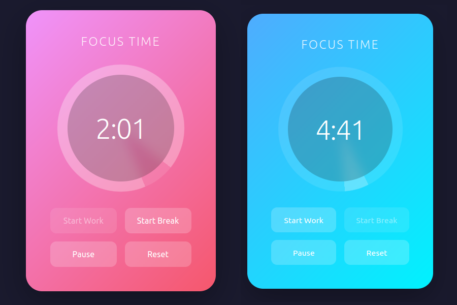

# 🍅 Pomodoro Timer Project

## What You're Building

You're going to create a **functional Pomodoro timer** - a real tool you might actually use while coding! The Pomodoro Technique is a time management method where you work for 25 minutes, then take a 5-minute break.

We've provided the JavaScript that handles the timing logic. Your job is to build the interface and make it beautiful, smooth, and satisfying to use.

This project combines HTML, CSS, **and JavaScript**! Don't worry - you won't write JavaScript yet. Instead, you'll learn how HTML elements can be connected to JavaScript functionality, and how CSS makes everything look polished and professional. But JavaScript is coming soon, and it's awesome! This project gives you an idea of what it can do and hopefully gets you excited to start working with it.



## Getting Started

1. Clone this repository to your local machine.

```bash
git clone https://github.com/onja-org/w2_css_animation_project_pomodoro_timer.git
```

2. Read through the entire README to understand the project requirements and timelines.
3. Go back and start with **Part 1**

## Project Setup

Your project folder contains:

- `index.html` - Skeleton HTML file (you'll build this out)
- `styles.css` - Empty CSS file (all your styles go here)
- `timer.js` - Complete JavaScript file (don't edit this! Just read it)
- `README.md` - This file you're reading now

## How the JavaScript Connection Works

The JavaScript file is like a robot that's looking for specific elements in your HTML. It identifies these elements by their `id` attribute. When it finds them, it makes them functional!

For example:

```html
<div id="time-display">25:00</div>
```

The JavaScript sees `id="time-display"` and knows "That's where I should show the time!"

**This is a fundamental concept in web development:** JavaScript handles behavior, HTML provides structure, and CSS handles appearance.

---

## Part 1: Understanding the Setup (30 minutes)

### Step 1: Read timer.js

Open `timer.js` and read the comments at the top. You'll see a list of required IDs. These are like "connection points" between your HTML and the JavaScript.

Required IDs:

- `time-display` - Where the time appears (like "25:00")
- `start-work-button` - Button to start a 25-minute work session
- `start-break-button` - Button to start a 5-minute break
- `pause-button` - Pauses the timer
- `reset-button` - Resets everything
- `timer-container` - Main container (JavaScript will add classes to this for different states)

> **TIP:** The JavaScript file contains two lines shown below that set the work and break times in seconds.
> You can adjust these values for testing your animations and design! Just change them to shorter times like `1 * 60` for 1 minute or `30` for 30 seconds. This way, you can see your design in action without waiting too long. Just save the JavaScript file and refresh your browser to see the changes.

```javascript
const WORK_TIME = 25 * 60; // 25 minutes
const BREAK_TIME = 5 * 60; // 5 minutes
```

### Step 2: Plan Your Design

Before coding, sketch out your timer interface. Consider:

- Where will the time display go?
- How will you arrange the buttons?
- What will change visually between work and break modes?
- What animations will make it feel polished?

Write down your ideas in a new file or draw a sketch on paper.

### Step 3: Test the Connection

Create a minimal HTML file with just the required elements and IDs. Open it in your browser. If the timer works (even if it's ugly), you're ready to move on!

---

## Part 2: Build the Structure (1 hour)

### Required HTML Elements

Your HTML must include ALL of these IDs for the timer to work:

```html
<!-- The main container - JavaScript adds classes to this -->
<div id="timer-container">
  <!-- Shows the time remaining -->
  <element id="time-display">25:00</element>

  <!-- Control buttons -->
  <button id="start-work-button">Start Work</button>
  <button id="start-break-button">Start Break</button>
  <button id="pause-button">Pause</button>
  <button id="reset-button">Reset</button>
</div>
```

You can:

- Use any HTML elements (divs, sections, buttons, etc.)
- Add extra elements for decoration or organization
- Include additional content (headings, instructions, quotes)
- Structure things however makes sense for your design

### Check Your Work

Open `index.html` in your browser. Click the buttons. You should see:

- Time counting down when you click "Start Work"
- Timer switching to 5:00 when you click "Start Break"
- Pause actually pausing
- Reset returning to 25:00

If it's not working, check that your IDs match exactly (spelling and capitalization matter!).

---

## Part 3: Core Styling (1 hour)

Time to make it look good! Focus on:

### Typography & Readability

- Make the time display large and easy to read
- Choose appropriate fonts
- Ensure good contrast

### Layout

- Center things nicely
- Create visual hierarchy
- Make buttons easy to click
- Consider mobile screens

### Basic Visual Design

- Choose a color scheme
- Style the buttons
- Add padding and spacing
- Create a cohesive look

### Tip: State Classes

The JavaScript automatically adds these classes to `timer-container`:

- `.work-mode` - During work sessions
- `.break-mode` - During break sessions
- `.paused` - When paused

Use these for different visual states:

```css
#timer-container.work-mode {
  background: var(--work-color);
}

#timer-container.break-mode {
  background: var(--break-color);
}
```

---

## Part 4: States & Animations (1.5 hours)

Now for the magic - making it feel alive and responsive!

### Different Visual States

Create distinct looks for:

- Work mode (focused, intense)
- Break mode (relaxed, calm)
- Paused state (clearly inactive)
- Default state (ready to start)

### Required Animations (choose at least 3)

- [ ] Smooth color transitions between states
- [ ] Button hover effects
- [ ] Click feedback on buttons
- [ ] Fade or slide transitions when switching modes
- [ ] Pulsing or breathing effect when paused
- [ ] Celebration animation when timer completes

### Progress Indicator

Show how much time has passed visually. Options:

- Progress bar that fills
- Circle that completes
- Background that changes
- Creative interpretation (sun moving, plant growing, etc.)

See the **Techniques Appendix** for circular progress code!

### Making It Smooth

Remember:

- Use `transition` for smooth state changes
- Consider `transform` for performance
- Don't overdo it - subtle often feels more professional

---

## Part 5: Polish & Personality (1+ hours)

This is where you make it yours!

### Ideas to Explore

**Themes & Moods**

- Dark mode / Light mode
- Seasonal themes
- Gradient backgrounds
- Glassmorphism effects

**Micro-interactions**

- Subtle animations on everything
- Satisfying state changes
- Smooth number transitions

**Creative Interpretations**
Instead of a basic timer, what if it was:

- A sunset/sunrise for work/break
- A battery charging/draining
- A plant growing with each session
- A journey progress visualization
- Abstract art that evolves

**Responsive Perfection**

- Looks great on phones
- Tablet-optimized layout
- Desktop takes advantage of space
- Animations that respect `prefers-reduced-motion`

**Advanced CSS Features**

- CSS custom properties for theming
- Grid or Flexbox layouts
- Blend modes
- Filters and effects
- SVG animations

---

## Bonus Challenges 🚀

### For the Speed Demons

**Multiple Themes System**
Create a theme switcher with at least 3 complete themes. Use CSS custom properties to make it maintainable.

**Session Counter**
Add a visual counter showing how many work sessions completed (pure CSS, using the state classes creatively).

**Advanced Animations**

- Staggered animations on button group
- Number flip animation on time change
- Particle effects on completion
- SVG morphing between states

**Performance Optimization**

- Use `will-change` appropriately
- Optimize animations for 60fps
- Reduce paint areas

**Accessibility Excellence**

- Focus states
- Screen reader friendly
- Keyboard navigation enhancement
- Respects all user preferences

---

## Techniques Appendix

### Circular Progress Indicator

Here's a technique using conic-gradient (copy and adapt):

```css
/* CSS Custom Properties for progress */
#timer-container {
  --progress: 0%; /* JavaScript updates this */
}

/* Circular progress using conic gradient */
.progress-ring {
  width: 300px;
  height: 300px;
  border-radius: 50%;
  background: conic-gradient(#3b82f6 var(--progress), #e5e7eb var(--progress));
  /* Add padding and inner circle to create ring effect */
  padding: 20px;
  background-origin: border-box;
  background-clip: padding-box, border-box;
}

/* Alternative: Linear progress bar */
.progress-bar {
  width: 100%;
  height: 8px;
  background: #e5e7eb;
  border-radius: 4px;
  overflow: hidden;
}

.progress-fill {
  height: 100%;
  width: var(--progress);
  background: linear-gradient(90deg, #3b82f6, #8b5cf6);
  transition: width 1s linear;
}
```

### Smooth State Transitions

```css
#timer-container {
  transition:
    background-color 0.5s ease,
    transform 0.3s ease;
}

#timer-container.work-mode {
  background: linear-gradient(135deg, #667eea 0%, #764ba2 100%);
}

#timer-container.break-mode {
  background: linear-gradient(135deg, #f093fb 0%, #f5576c 100%);
  transform: scale(0.98); /* Subtle shrink for break */
}
```

### Button Micro-interactions

```css
button {
  transition: all 0.2s ease;
  cursor: pointer;
}

button:hover {
  transform: translateY(-2px);
  box-shadow: 0 5px 15px rgba(0, 0, 0, 0.2);
}

button:active {
  transform: translateY(0);
  box-shadow: 0 2px 5px rgba(0, 0, 0, 0.2);
}

/* Different states for buttons */
button:disabled {
  opacity: 0.5;
  cursor: not-allowed;
}
```

---

## Final Tips

1. **Test frequently** - Keep checking that the timer still works as you add styles
2. **State classes are powerful** - Use `.work-mode`, `.break-mode`, and `.paused` for major visual changes
3. **Performance matters** - Too many animations can make it feel sluggish
4. **Make it yours** - The best timer is one you'd actually want to use
5. **Have fun** - This is an interactive project. Experiment!

## When You're Done

You've built a real, working tool! This timer demonstrates:

- How HTML, CSS, and JavaScript work together
- State management in applications
- Polished, professional interactions
- Your growing skills as a developer
